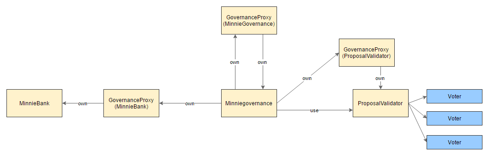

# What is this?

This repository contains Solidity code that allows deploying an ecosystem of Ethereum contracts that are described below.

These contracts aim to help the FreeFtopia community to collaborate on the project. Their main features:

- a token system for rewards
- a voting system for updating the system (new contributors, new features, changing the existing configuration, or even changing the actual rules)
- a governance system that ensures security and flexibility (by allowing to rewrite the rules by replacing some core contracts in the ecosystem).

A first feature is built in this codebase: **contributors declare each week their individual contributions to the project on a scale from 0 to 3, and get automatic token in reward**. Please refer to [this article](https://medium.com/free-ftopia/a-new-vision-for-primitive-accumulation-10245e571d99) to understand better this feature and how it should be put in use by the community.

# Contracts documentation

## Main contracts

### MinnieGovernance

Access to *governance proxies* for itself, MinnieBank and Proposal Validator.

This is the controlling unit.

### MinnieBank

Token management.

This is a token ledger, that allows:

- storing contributors addresses and their related balance, rewarding them (adding tokens to their balance) or penalising them (removing tokens from their balance)
- managing permissions through storing trusted addresses: these addresses have the right to reward or penalise contributors
- control of the core settings of the contract to be exclusive to its owner (which will be the MinnieGovernance through a proxy): registering and removing contributors.

**Note:** that the rewarding and penalising methods create (resp. detroy) tokens.

This is accompanied with a bankTrusted mixin that allows other contracts to get access to MinnieBank's contributors permissions system.

### ProposalValidator

Voting system to allow execution of *Proposals* (see below).

As long as the voting constraints defined by the ProposalValidator are met (by default: quorum) are met, a proposal may perform any action *on behalf of the MinnieGovernance*.

Thus, proposals may produce the following effects when getting executed:

- Perform any kind of action through the MinnieBank, notably tokens transfer, like sharing existing tokens in the bank amongst contributors.
- Perform any kind of action through the ProposalValidator, like:
	- registering other proposals
	- adding a new voter
	- changing the quorum for votes...
- Deploy a new contract (like what the DeployReporterProposal is doing, see below)
- Delete a contract in the ecosystem.
- Change the rules of the Governance by replacing it by a new contract.
- Or similarly replace the MinnieBank or the ProposalValidator to have a new set of configuration.

## Contracts-ownership logic

We aim here at having contracts that are replaceable, notably the MinnieGovernance.

The system is based on delegate calls with proxy contracts. Each of the main contracts has a GovernanceProxy contract that is owning it. This allows for ownership to be changed both ways.

This ownership change is done in the initialisation phase of the MinnieGovernance contract, with `createGovernanceProxy`.

## Proposals

Proposals have to comply with the `Proposal` abstract contract. You can refer to the TestProposal which is built for demonstration purpose.

Note that an important feature of proposals is that they should declare which proxies they want access to (through `_requestedProxies`). This allows to reduce the potential side-effects of proposals and thus increase security.

### PeriodicContributionRepository

The DeployReporterProposal when executed, deploys the PeriodicContributionRepository.

This contract is a typical example of what a contract might be doing to add some "features" to the community.

It aims at allowing members of the community to periodically (default: each week) *report how much work they have contributed themselves*, on a scale from 0 to 3:

- 0: nothing
- 1: some social activity
- 2: a minimal amount of work on a given task
- 3: a more significant amount of work, either several small tasks or a bigger one.

In response to this, the contract will reward the contributor by triggering a payout from the MinnieBank to the contributor, in pre-defined amounts depending on how much work was contributed. Note: these payouts are done in *newly generated tokens*, which increase the total supply of the MinnieBank.

# Deploy

Scenario to deploy and execute `TestProposal` from scratch:

- Create `MinnieGoverance`
- Launch `createProposalValidator`
- Launch `createMinnieBank`
- Launch `createGovernanceProxy` 
- Create `TestProposal`
- Instanciate `ProposalValidator`
- Launch `ProposalValidator.vote(test proposal addr, true)`
- Launch `MinnieGovernance.executeProposal(test proposal addr)`
